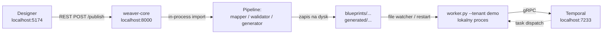
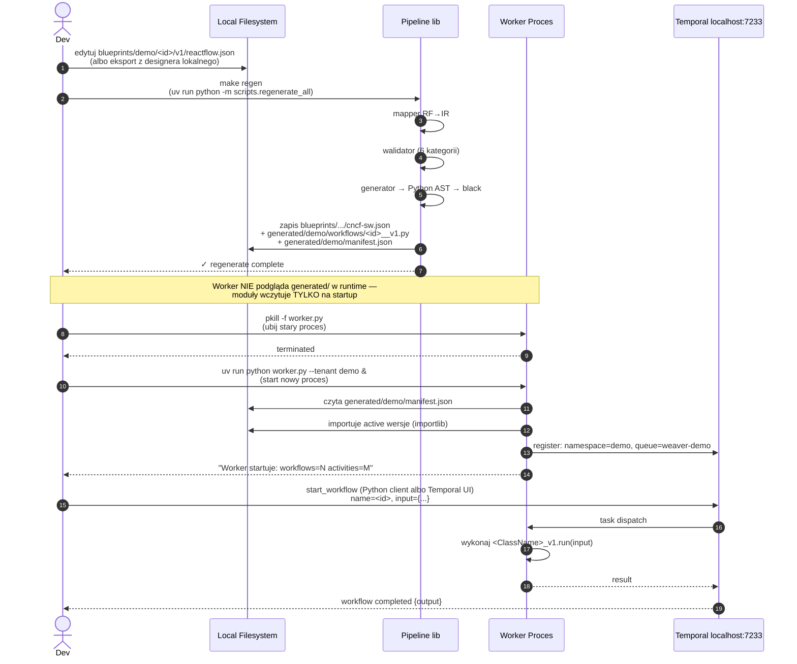
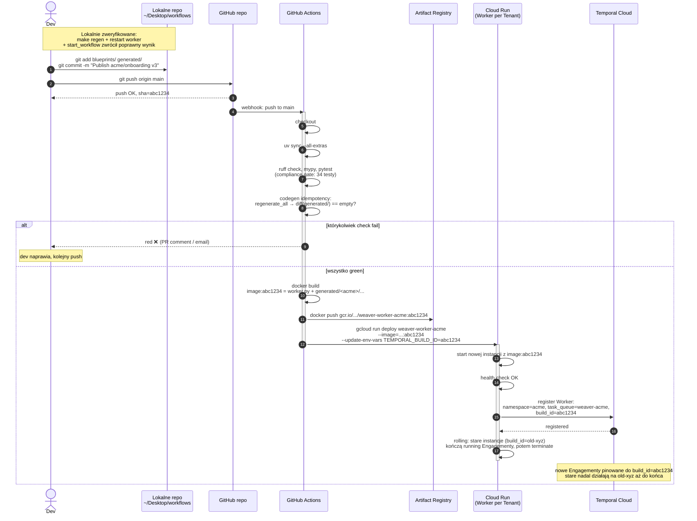
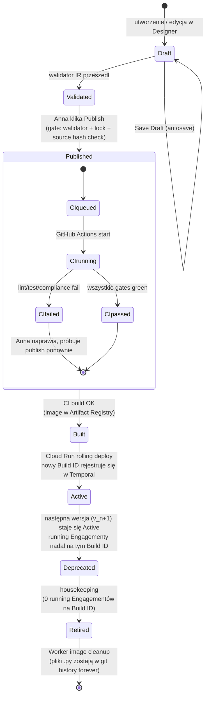
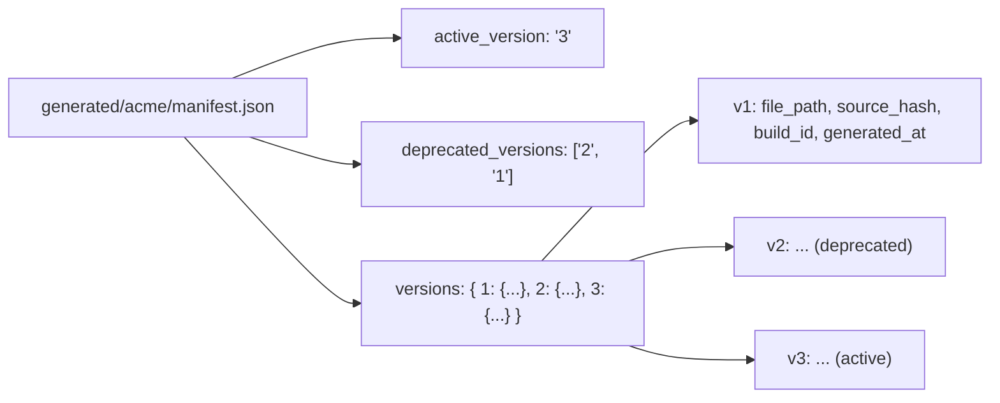
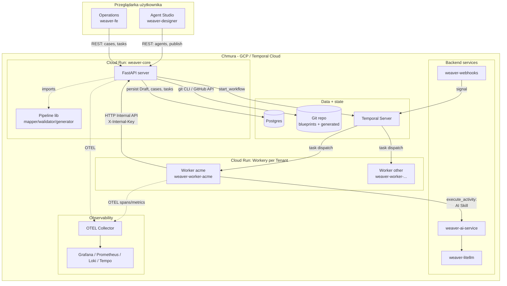
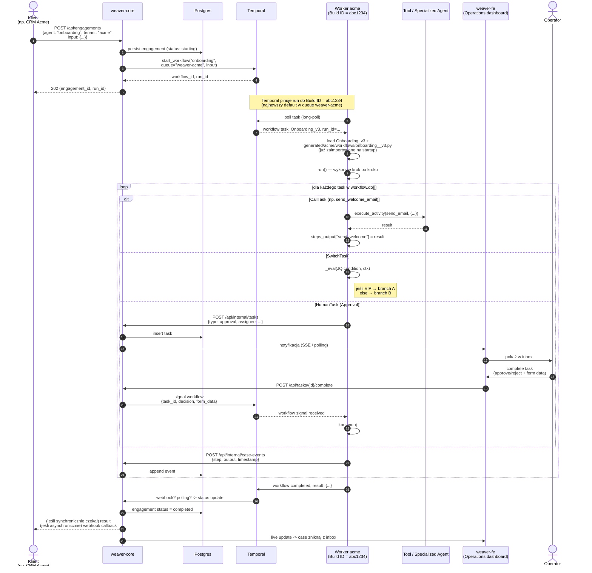

# Publish Flow — od kliknięcia w Designerze do uruchomionego Engagementu

**Dwa tryby:** lokalny (development, sekundy) i chmurowy (production, minuty). Pełna ścieżka: jak Agent Blueprint zaprojektowany w UI staje się działającym Workerem na Temporalu.

> **Model:** GitOps. Developer pracuje lokalnie → testuje lokalnie → `git push` (świadomy krok). Push triggeruje CI/CD, który buduje obraz workera i deployuje do chmury. **Nie** ma "magicznego publish-via-UI w cloudzie" — dev decyduje kiedy promować zmiany.

## Dwa tryby — porównanie

| Wymiar | **Tryb lokalny (dev)** | **Tryb chmurowy (production)** |
|---|---|---|
| Cel | Szybki dev cycle, smoke test po zmianach | Stabilny deploy z auditem i versioningiem |
| Cykl Publish → działa | **5–10 sekund** | ~5 minut |
| Persistence Blueprintu | Bezpośrednio w lokalnym katalogu (`blueprints/`, `generated/`) | Git commit + push |
| Build / pakowanie | Brak — generator pisze `.py` na dysk | Docker build + push do Artifact Registry |
| Worker | Proces lokalny (`python worker.py`) | Cloud Run service per Tenant |
| Worker Versioning | Brak — restart workera po zmianie | Build ID, rolling deploy bez przerwy |
| Temporal | `temporal server start-dev` lokalnie | Temporal Cloud / self-hosted |
| Co potrzebne | Python 3.12, `uv`, `temporal` CLI, Docker (opcjonalnie dla Sonara) | GCP project, Artifact Registry, Cloud Run, GitHub Actions, Temporal Cloud account |

---

## Tryb lokalny (development) — TL;DR



Brak gita, brak CI, brak Cloud Run, brak Build ID. Edycja → publish → restart workera → workflow działa. **5–10 sekund**.

## Tryb chmurowy (production) — TL;DR

```mermaid
flowchart LR
    A[Dev:<br/>lokalny smoke test OK] -->|git add + commit + push| B[GitHub repo]
    B -->|webhook| C[GitHub Actions:<br/>lint / test / compliance]
    C -->|docker build| D[Docker image:<br/>worker.py + generated/...]
    D -->|push| E[Artifact Registry]
    E -->|gcloud run deploy| F[Cloud Run:<br/>Worker per Tenant]
    F -->|register Build ID| G[Temporal Cloud]
    G -.->|nowe Engagementy| F
```



**Cloud flow zaczyna się od `git push`** — czyli świadomej decyzji devu po przejściu lokalnego smoke testu. Nie ma "publish via UI" w cloudzie. ~5 minut od push do "v3 active w Cloud Run".

---

## Tryb lokalny — szczegóły

### Setup raz (one-time)

```bash
# 1. Temporal Server lokalnie (jeden raz, w tle)
temporal server start-dev --port 7233 --ui-port 8233 &

# 2. Stwórz namespace per Tenant (jednorazowo, idempotentne)
temporal operator namespace create demo --address localhost:7233

# 3. Zainstaluj zależności
cd ~/Desktop/workflows && uv sync --all-extras
```

Temporal UI: http://localhost:8233 (możesz tam podglądać Engagementy).

### Dev cycle (powtarzane przy każdej zmianie Agent Blueprintu)



### Konkretne komendy

```bash
# Pełen cykl publish-and-test:
cd ~/Desktop/workflows

# 1. Edytuj blueprint
$EDITOR blueprints/demo/sample/v1/reactflow.json

# 2. Regenerate (pisze IR + .py + manifest)
make regen
# albo per blueprint: uv run python -m scripts.regenerate_workflow blueprints/demo/sample/v1/reactflow.json

# 3. Restart worker
pkill -f "worker.py"
uv run python worker.py --tenant demo --target localhost:7233 &

# 4. Trigger workflow
uv run python -c "
import asyncio
from temporalio.client import Client

async def main():
    c = await Client.connect('localhost:7233', namespace='demo')
    h = await c.start_workflow('sample', {'tier': 'vip'},
                                id='dev-test-001', task_queue='weaver-demo')
    print(await h.result())

asyncio.run(main())
"

# 5. Podgląd w Temporal UI
open http://localhost:8233
```

### Co zawiera target `make regen` (już w `Makefile`)

```makefile
regen:
	uv run python -m scripts.regenerate_all
```

Skrypt `regenerate_all.py` iteruje wszystkie `blueprints/<tenant>/<bp>/v<n>/reactflow.json`, wywołuje `regenerate_workflow.py` per blueprint (pipeline RF→IR→walidator→generator + manifest update). Idempotentny — niezmienione IR (source hash match) NIE regeneruje `.py`.

### Skróty (które można dodać do Makefile)

```makefile
.PHONY: dev-cycle restart-worker

restart-worker:
	pkill -f "worker.py" 2>/dev/null || true
	sleep 1
	nohup uv run python worker.py --tenant $${TENANT:-demo} \
	      --target localhost:7233 > /tmp/worker-$${TENANT:-demo}.log 2>&1 &
	@echo "Worker restartowany. Log: /tmp/worker-$${TENANT:-demo}.log"

dev-cycle: regen restart-worker
	@echo "✓ regenerate + worker restart complete"
```

Wtedy jedna komenda: `make dev-cycle` (lub `make dev-cycle TENANT=acme` dla innego tenanta).

### Czego NIE robimy lokalnie

| Krok cloud flow | Czemu pominięty lokalnie |
|---|---|
| Git commit | Pliki idą bezpośrednio na dysk; w lokalnym dev nie potrzebujemy historii |
| GitHub Actions | Brak buildu — generator produkuje `.py` od ręki |
| Docker build / image push | Worker uruchamiany jako proces Pythona, nie kontener |
| Cloud Run rolling deploy | Brak — `pkill + start` to "rolling deploy" lokalny |
| Build ID Versioning | Tylko 1 wersja workera w danym momencie; restart = cutover |
| Temporal Cloud | `temporal server start-dev` na localhost |

### Compromise: brak rolling deployu lokalnie

Lokalnie po `pkill worker.py` przez 1-2 sekundy (zanim nowy worker wstanie) **żaden Engagement nie jest wykonywany**. Już running Engagementy są pauzowane przez Temporal (czeka aż worker wróci) — dane nie giną. Dla dev acceptable; dla produkcji potrzebny Build ID Versioning (cloud flow).

### Worker — czy może hot-reload bez restartu?

Krótka odpowiedź: **nie w MVP**, bo:
1. Python sam nie reloduje już zaimportowanych modułów (`importlib.reload` ma ograniczenia z classes / dependencies)
2. Temporal Worker SDK rejestruje workflow classes na starcie; zmiana kodu wymaga ponownej rejestracji
3. Workflow Sandbox cache'uje pre-imported moduły

Możliwe rozszerzenie post-MVP: file watcher (`watchdog`) na `generated/<tenant>/manifest.json` — przy zmianie wysłanie sygnału do workera, on wykonuje `os.execv()` (re-exec procesu Pythona) z tym samym command line. To efektywnie restart, ale "z poziomu siebie" — bez konieczności pkill z zewnątrz. Nie konieczne dla MVP.

---

## Tryb chmurowy — szczegóły

---

## 1. Aktorzy — kto gdzie żyje

| Aktor | Co to fizycznie | Gdzie działa | Kto napisał |
|---|---|---|---|
| **Designer** | Strona w przeglądarce (TypeScript/React + React Flow) | Komputer użytkownika | `weaver-designer` repo |
| **weaver-core** | Serwer Python (FastAPI) | Kontener Cloud Run | `weaver-core` repo |
| **Pipeline `workflows`** | **Biblioteka Pythona** zaimportowana przez core (in-process) | Wewnątrz tego samego kontenera co core | `workflows` repo (to nasze) |
| **Git repository** | Repo na GitHubie z Blueprintami i wygenerowanym kodem | github.com | infrastruktura |
| **GitHub Actions** | Efemeryczna VM uruchamiająca build | runner GitHuba | `.github/workflows/build-worker.yml` |
| **Artifact Registry** | Magazyn obrazów Docker | GCP Artifact Registry | infrastruktura |
| **Cloud Run service** | Serverless container runtime — jeden service per Tenant | GCP, region `europe-west2` | infrastruktura + `worker.py` |
| **Temporal Server** | Silnik durable workflow (orkiestrator) | Temporal Cloud lub self-hosted | infrastruktura |
| **Worker (proces)** | Kontener z `worker.py` + wygenerowane `.py` per tenant | Cloud Run instance | `workflows` repo |

---

## 2. Cloud Promotion — sekwencja (swimlane, gitops)

Punkt startu: dev ma już lokalnie zweryfikowany blueprint + wygenerowane `.py`. Decyduje że gotowe na cloud.



### Kluczowe timing

| Krok | Czas typowy |
|---|---|
| 1-3 (commit + push) | <10s |
| 4-7 (CI: lint, type, test, compliance, idempotency) | 1-2 min |
| 8-9 (CI: docker build + push) | 2-3 min |
| 10-13 (Cloud Run deploy + Temporal register) | 30-90s |
| **Razem od `git push` do "v3 active w Cloud Run"** | **≈ 5 min** |

### Dlaczego dev push do gita zamiast UI publish

| Argument | Szczegół |
|---|---|
| Świadomy promotion | Dev decyduje kiedy zmiana jest gotowa, po lokalnym teście |
| Code review przed deploy | PR-y, recenzja zmian w `generated/` (sanity check że nikt nie ręcznie modyfikował) |
| Audit trail | git history = dokładnie co i kiedy poszło na produkcję, kto zatwierdził |
| Rollback | `git revert` + push → CI buduje stary stan, deploy = rollback |
| GitOps standard | Wszystkie zmiany infrastruktury / kodu przez git, jeden mental model |
| Nie ma "live UI publishing prod" | Mniejsze ryzyko że ktoś przez przypadek wypchnie zmianę na prod |

---

## 3. Lifecycle Agent Blueprintu



### Stany w manifeście



---

## 4. Architektura komponentowa (kto z kim gada)



### Kanały komunikacji

| Skąd → Dokąd | Protokół | Po co |
|---|---|---|
| Designer → core | HTTPS REST | Save Draft, Publish, Read Blueprint history |
| Operations FE → core | HTTPS REST | Lista cases, task inbox, complete human task |
| core → Pipeline lib | in-process Python call | Mapper, walidator, generator (synchroniczne) |
| core → Postgres | TCP (asyncpg) | Persistence |
| core → Git | git CLI / GitHub API | Commit po Publish |
| core → Temporal | gRPC (Temporal SDK) | start_workflow, signal, query |
| Webhooks → Temporal | gRPC | Signal do oczekujących workflows |
| Temporal → Worker | gRPC long-poll | Task dispatch (Worker pulluje taski) |
| Worker → core (Internal API) | HTTPS REST + X-Internal-Key | Persist case events, status, human task creation |
| Worker → AI service | HTTPS REST | LLM completion |
| AI service → LiteLLM | HTTPS REST | Provider routing |
| Worker → OTEL | OTLP gRPC/HTTP | Telemetria |

---

## 5. Engagement Runtime — sekwencja

Co się dzieje gdy klient startuje Engagement (już po publishu, na działającym Workerze):



### Kluczowe obserwacje runtime

| Obserwacja | Dlaczego ważne |
|---|---|
| Worker **pulluje** taski z Temporal (long-poll), nie odwrotnie | Skalowalność — nowe Workery dołączają, Temporal nie musi ich znać apriori |
| Workflow code jest **deterministyczny** | Temporal może odtworzyć stan po restarcie z historii (replay); bez determinizmu replay nie działa |
| Activity (Tool, Specialized Agent) **NIE** jest deterministyczna | Może mieć I/O, side effects; Temporal to zapamiętuje raz w historii i nie wykonuje ponownie |
| Human Task pauzuje workflow przez **Temporal signal** | Workflow wisi tygodniami, czekając aż operator kliknie — to OK, Temporal storage to obsługuje |
| Worker → core przez **Internal API** (osobny X-Internal-Key) | Bo komunikacja maszyna-maszyna, nie wymaga JWT usera |

---

## 6. Worker Versioning Build ID — co to znaczy w praktyce

Najtrudniejsza część do zrozumienia. Diagram timeline:

```mermaid
gantt
    title Życie wersji Workera podczas deploy v2 → v3
    dateFormat HH:mm
    axisFormat %H:%M

    section Build ID = old-xyz (v2)
    accepting nowe Engagementy : done, v2a, 09:00, 60m
    running Engagementy v2     : done, v2b, 09:00, 180m
    sunset (running only)      : done, v2c, after v2a, 120m
    drained (0 running)        : done, v2d, after v2b, 5m
    terminated (Cloud Run)     : crit, v2e, after v2d, 1m

    section Build ID = abc1234 (v3)
    image build (CI)           : active, v3a, 09:55, 5m
    deploy + register          : active, v3b, after v3a, 2m
    accepting nowe Engagementy : active, v3c, after v3b, 999m
```



### Faza 1: oba Build ID działają (overlap)

```
Czas 09:00 - 10:02
Worker pool acme:
  ├─ Instance #1 (Build ID = old-xyz, v2) — running 5 Engagementów
  ├─ Instance #2 (Build ID = old-xyz, v2) — running 3 Engagementy
  └─ Instance #3 (Build ID = abc1234, v3) — JUST STARTED, accepting new

Temporal kieruje:
  ├─ Engagementy started przed 10:02 → existing Build ID old-xyz (do skończenia)
  └─ Engagementy started po 10:02 → najnowszy default = abc1234
```

### Faza 2: stare Engagementy się skończyły, sunset starszego Build ID

```
Czas 12:00 (po 2h)
Worker pool acme:
  ├─ Instance #3 (Build ID = abc1234, v3) — running new Engagementy
  └─ Instance #1, #2 (Build ID = old-xyz, v2) — 0 running Engagementów

Cloud Run cleanup:
  └─ terminate Instance #1, #2 (są niepotrzebne)

Manifest update przez housekeeping job (cron):
  generated/acme/manifest.json:
    blueprints.onboarding.deprecated_versions = ["v2"] → status: retired
```

---

## 7. Dlaczego ta architektura — krótka justyfikacja

| Wybór | Alternatywa | Dlaczego tak |
|---|---|---|
| Pipeline jako **biblioteka in-process** w core, nie osobny serwis | Microservice `workflows-service` z gRPC | Prostota, transakcyjność z DB lock, mniej deployment surface; refaktor do mikroserwisu gdy publish staje się bottleneckiem |
| **Codegen `.py`** zamiast interpretera DSL | InterpreterWorkflow walking adjacency graph z DB | Native Temporal patterns (replay, versioning), type safety, audit przez git, nie dublujemy Temporal SDK — patrz ADR-001 |
| **Worker per Tenant** (osobny Cloud Run service) | Wspólny Worker dla wszystkich Tenantów | Fizyczna izolacja (decyzja #4), separate scaling, namespace per Tenant w Temporalu |
| **Build ID = sha krótki commit** | Semver / monotoniczny licznik | Kanonicznie identyfikuje konkretny stan kodu; deterministic; idempotent |
| **Pliki `.py` w git** zamiast w blob storage | Zapisywać artefakty do GCS / S3 | Git history = audit forever, replay starych Engagementów po refleksji, code review, easy diff między wersjami |
| **GitHub Actions** zamiast custom CI | Jenkins / Argo / TeamCity | Najmniejsza powierzchnia deployment; już mamy GitHub jako source of truth |

---

## Powiązane dokumenty

- `ARCHITECTURE.md` — wysokopoziomowa architektura
- `PIPELINE.md` — gates, idempotency, SLO
- `MULTI_TENANT.md` — operacyjny guide tenant isolation
- `IR_SPEC.md` — specyfikacja CNCF SW IR JSON
- `adr/ADR-003-compiled-py-per-blueprint.md` — uzasadnienie codegen
- `adr/ADR-005-worker-versioning-build-id.md` — Worker Versioning detail
- `adr/ADR-006-tenancy-isolation.md` — model izolacji
